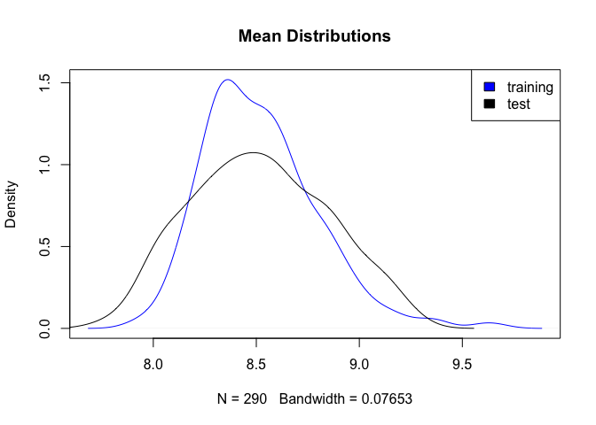
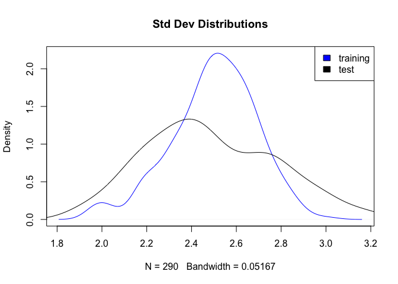
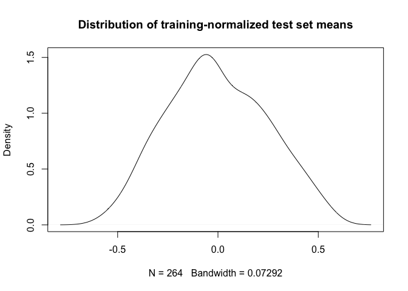
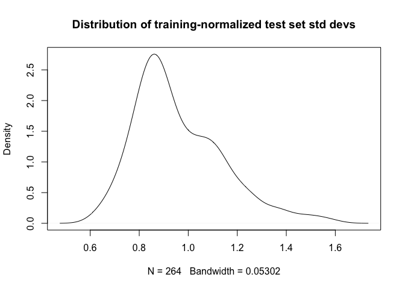

# classifier-normalization


## "Standardization" in Kuiper et al

Kuiper et al. standardizes a testset by subtracting of the mean of a _training_ set and dividing by the std dev of that _training_ set.  This does _not_ transform the distribution of the testset to that of the training set.  I suspect it is intended to do that, but the authors made a logical mistake.  Further, I think they got lucky in that the training and test distributions are very similar--so that their odd transformation is effectively a "standard" standardization (i.e., standardizing a data set by _its own_ mean and standard deviation).  Below I show that the training and test sets of Kuiper have similar distributions, so their standardized of the test set by the training set is similar to a standard standardization.  Further, the training-standardized test set clearly does not have the same distribution as the original training set.


```r
# For rowSds
library("matrixStats")
```

```
## matrixStats v0.51.0 (2016-10-08) successfully loaded. See ?matrixStats for help.
```

```r
# Load the Kuiper training and test data
load("batchCorrectedData.R")

# This follows the code in sourcescript.txt in the supp of Kuiper.
testset <- batchCorrectedData$gepall[, batchCorrectedData$batchesall["APEX",]]
trainset <- batchCorrectedData$gepall[, batchCorrectedData$batchesall["H65",]]

# For convenience, here is the standardization code.
# A bunch of transposes and ensuring consistency of columns/features
# across the two matrices.  But, essentially: subtract the mean of the
# training data from the test data and normalize by the std dev of the
# training data.
meanvarstandardize<-function(testdata,traindata=""){
	if (class(traindata)!="matrix"){ traindata=testdata}
	inters<-intersect(colnames(traindata),colnames(testdata))
	trainmean<-colMeans(traindata[,inters])
	trainsd<-apply(traindata[,inters], 2, sd)
	
	testdata<-t(t(testdata[,inters])-trainmean)
	testdata<-t(t(testdata)/trainsd)
	return(testdata)
}
```

## Distribution of means for both training and test sets.

They are fairly similar.


```r
plot(density(rowMeans(t(trainset))), main="Mean Distributions", col="blue")
lines(density(rowMeans(t(testset))), col="black")
legend("topright", legend=c("training", "test"), fill=c("blue", "black"))
```

<!-- -->

## Distribution of std devs for both training and test sets.

They are fairly similar.


```r
plot(density(rowSds(t(trainset))), main="Std Dev Distributions", col="blue")
lines(density(rowSds(t(testset))), col="black")
legend("topright", legend=c("training", "test"), fill=c("blue", "black"))
```

<!-- -->

## Distribution of test mean and std dev following standardization against training set

This is very nearly a standardized distribution.  And it is very clearly not similar to the distribution of the original training set, if that was the intent.


```r
test.standardized <- meanvarstandardize(t(testset), t(trainset))
plot(density(rowMeans(test.standardized)), main="Distribution of training-normalized test set means")
```

<!-- -->


```r
plot(density(rowSds(test.standardized)), main="Distribution of training-normalized test set std devs")
```

<!-- -->

## Distribution of test mean and std following standard standardization (against test set)

This is a sanity check.

Obviously, means are 0 and std devs are 1.


```r
test.typical.standardized <- meanvarstandardize(t(testset), t(testset))
max(colMeans(test.typical.standardized))
```

```
## [1] 1.612209e-15
```

```r
max(abs(colSds(test.typical.standardized)-1))
```

```
## [1] 5.551115e-16
```
